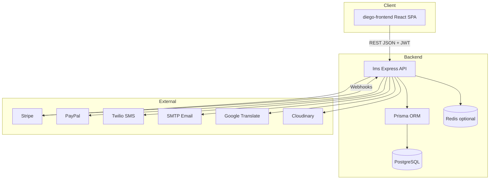
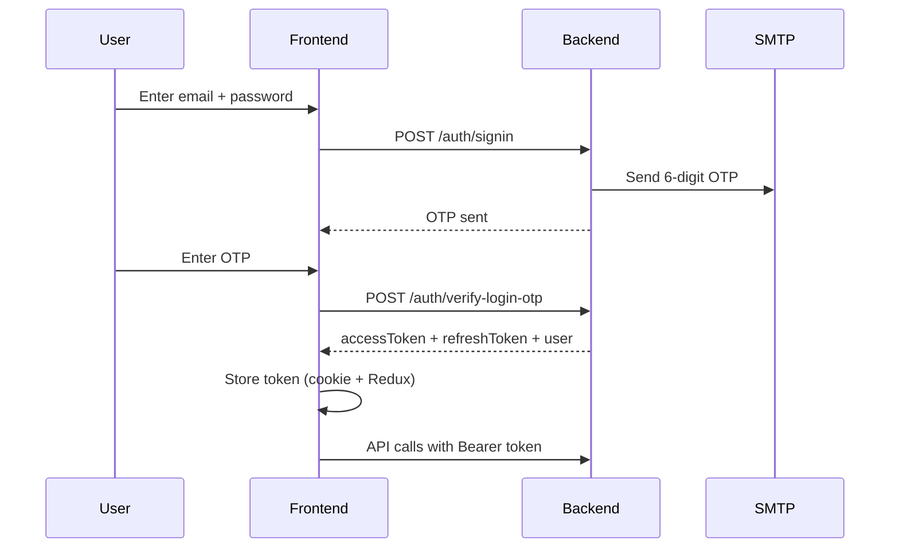
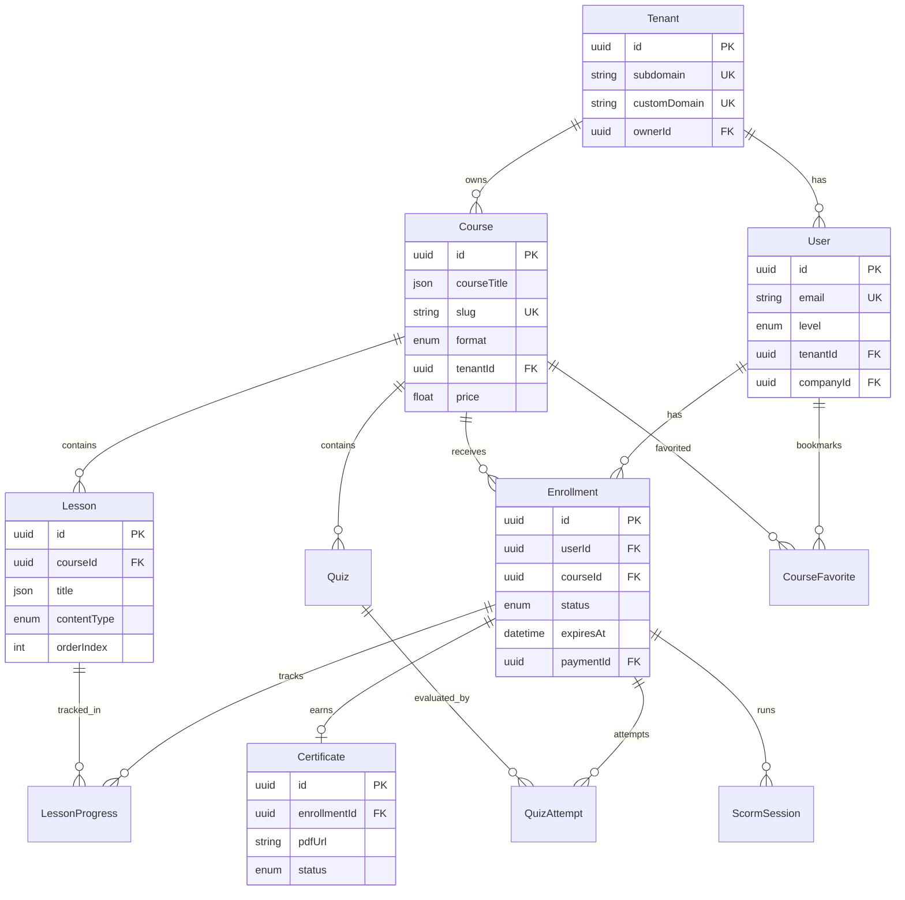
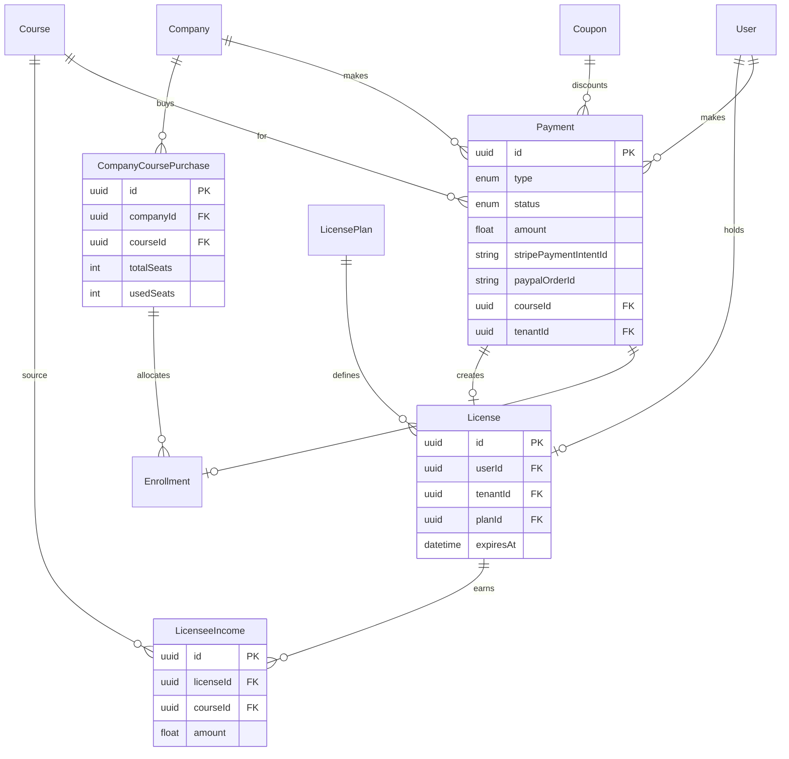
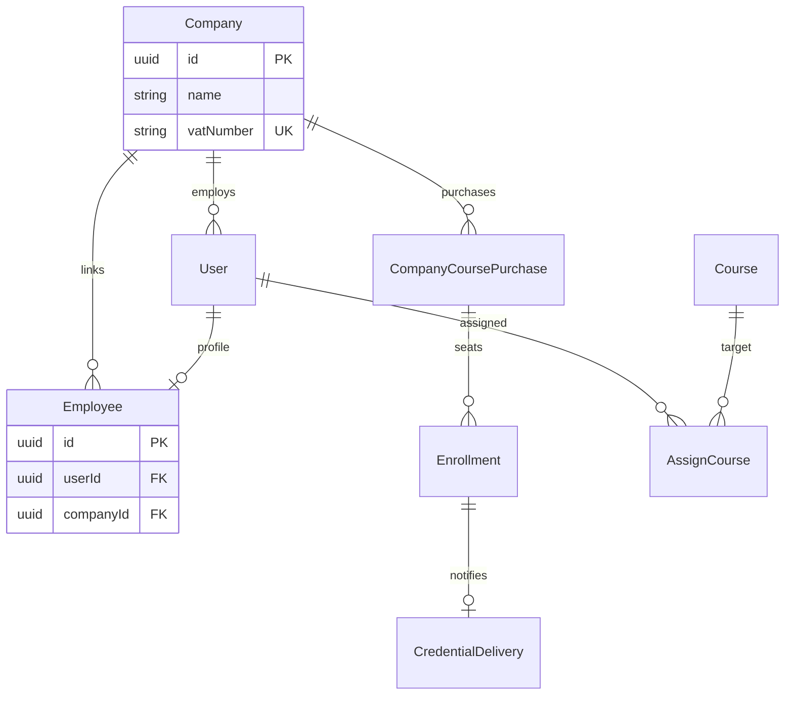
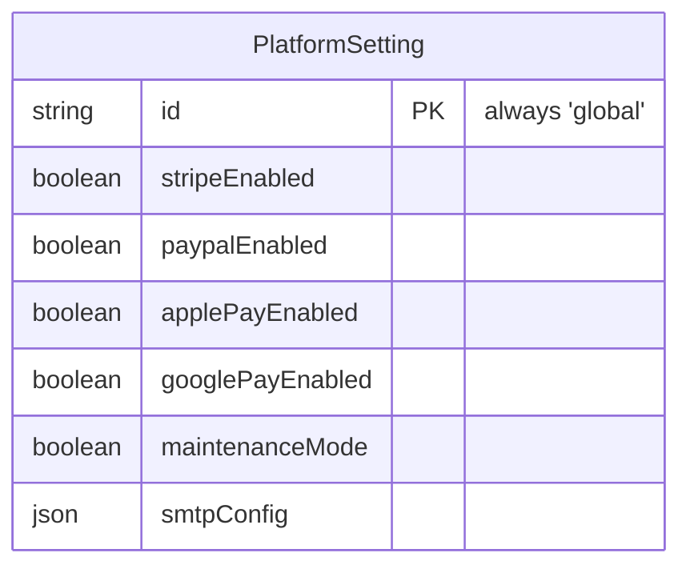

# Diego LMS — Advanced Developer README

**Version:** 1.0  
**Last updated:** August 2026  
**Repositories:**

| Repo | Path | Role |
|------|------|------|
| **Backend API** | `lms/` | Node.js + Express 5 + Prisma + PostgreSQL |
| **Frontend SPA** | `diego-frontend/` | React 18 + Vite + Redux Toolkit + RTK Query |

**Base API URL:** `http://localhost:5000/api/v1` (development)  
**Frontend URL:** `http://localhost:5173`

---

## Table of contents

1. [System overview](#1-system-overview)
2. [Tech stack](#2-tech-stack)
3. [Local development setup](#3-local-development-setup)
4. [Project structure](#4-project-structure)
5. [Architecture patterns](#5-architecture-patterns)
6. [Authentication & authorization](#6-authentication--authorization)
7. [Multi-tenancy](#7-multi-tenancy)
8. [Database design](#8-database-design)
9. [ERD diagrams](#9-erd-diagrams)
10. [API reference](#10-api-reference)
11. [Postman collections](#11-postman-collections)
12. [Frontend architecture](#12-frontend-architecture)
13. [Third-party integrations](#13-third-party-integrations)
14. [Background jobs & seeds](#14-background-jobs--seeds)
15. [Testing & debugging](#15-testing--debugging)
16. [Deployment notes](#16-deployment-notes)
17. [Conventions for new developers](#17-conventions-for-new-developers)
18. [Related documentation](#18-related-documentation)

---

## 1. System overview

Diego LMS is a **multi-tenant Learning Management System** supporting:

- **Individual learners** (`PRIVATE_USER`) — buy courses, progress, certificates
- **Companies** (`COMPANY_ADMIN` / `COMPANY_EMPLOYEE`) — bulk purchase, assign seats, track employees
- **License holders** (`LICENSE_USER`) — white-label branded catalog under a `Tenant`
- **Platform admins** (`PLATFORM_ADMIN`) — cross-tenant management

### Core business flows

```
Public catalog → Checkout (Stripe/PayPal) → Enrollment → Lessons/SCORM/Quiz
                                                      → Certificate → Archive storage

Company admin → Company purchase → Assign seat / Invite → Employee enrollment

License user → Create courses under tenant → Students enroll → Licensee income share
```

### High-level component diagram



---

## 2. Tech stack

### Backend (`lms`)

| Layer | Technology |
|-------|------------|
| Runtime | Node.js 18+ |
| Framework | Express 5 |
| ORM | Prisma 5 → PostgreSQL |
| Validation | Zod |
| Auth | JWT + OTP (email) |
| Payments | Stripe, PayPal |
| Email | Nodemailer (SMTP) |
| SMS | Twilio |
| Translation | Google Cloud Translation API |
| Files | Multer + local `/uploads` + Cloudinary |
| Cron | node-cron |
| Package manager | **pnpm 10** |

### Frontend (`diego-frontend`)

| Layer | Technology |
|-------|------------|
| Framework | React 18 |
| Build | Vite |
| Routing | React Router v6 |
| State | Redux Toolkit + RTK Query (`baseApi`) |
| Forms | React Hook Form |
| Styling | Tailwind CSS |
| i18n | i18next (it, en, fr, zh) |
| Payments UI | Stripe.js, PayPal JS SDK |

---

## 3. Local development setup

### 3.1 Prerequisites

- Node.js 18+
- pnpm (`npm i -g pnpm`)
- PostgreSQL 14+
- Redis (optional)
- Git

### 3.2 Backend

```bash
cd lms
pnpm install                  # runs prisma generate
cp .env.example .env          # fill all required vars
pnpm run prisma:migrate       # apply migrations
pnpm run dev                  # http://localhost:5000
```

**Health check:** `GET http://localhost:5000/health`

### 3.3 Frontend

```bash
cd diego-frontend
pnpm install                  # or npm install
cp .env.example .env
pnpm run dev                  # http://localhost:5173
```

**Required frontend env:**

```env
VITE_API_BASE_URL=http://localhost:5000/api/v1
VITE_STRIPE_PUBLISHABLE_KEY=pk_test_...
VITE_PAYPAL_CLIENT_ID=...
```

### 3.4 Default admin (after seeds)

Check `lms/.env` → `ADMIN_EMAIL` / `ADMIN_PASSWORD`  
Run: `pnpm run seeds:admin` if needed.

### 3.5 Demo data

```bash
cd lms
pnpm run seeds:course-demo    # full demo course
pnpm run seeds:package        # packages
pnpm run prisma:studio        # DB GUI
```

---

## 4. Project structure

### 4.1 Backend (`lms/src`)

```
src/
├── bootstrap.js              # DB connect, seeds, cron start
├── server.js                 # Express middleware stack
├── app.js
├── config/                   # env, db, logger, cloudinary
├── routes/index.js           # Mounts all /api/v1/* routes
├── features/                 # Domain modules (30+)
│   └── {feature}/
│       ├── {feature}.route.js
│       ├── {feature}.controller.js
│       ├── {feature}.service.js
│       └── {feature}.validation.js   # Zod schemas
├── shared/
│   ├── globals/helpers/      # auth, tenant, i18n, response
│   ├── services/             # email, sms, translate
│   ├── jobs/                 # cron tasks
│   └── upload/               # multer presets
├── seeds/
└── generated/prisma/         # Prisma client output
```

### 4.2 Frontend (`diego-frontend/src`)

```
src/
├── main.jsx
├── App.jsx
├── router/router.jsx         # Route definitions + guards
├── config/
│   ├── routes.js             # Dashboard path constants
│   ├── env.config.js
│   └── api/httpEndpoint.js   # API path constants
├── features/
│   ├── api/                  # RTK Query (baseApi + *Api.js)
│   ├── auth/                 # authSlice, login flow
│   ├── admin/                # mappers, admin services
│   ├── public/               # catalog, checkout, payment
│   ├── private/              # student dashboard services
│   ├── company/              # company admin services
│   └── learning/             # course player, video progress
├── pages/
│   ├── public/               # Landing, checkout, catalog
│   └── dash/                 # Role-based dashboards
│       ├── super/            # Platform admin
│       ├── license/          # License user
│       ├── company/          # Company admin + employee
│       └── private/          # Private user
├── components/               # Shared UI
└── layout/                   # DashboardSidebar, layouts
```

---

## 5. Architecture patterns

### 5.1 Feature-sliced backend

Each domain is isolated:

```
HTTP Request → route.js → controller.js (catchAsync) → service.js → Prisma
                              ↓
                        validation.js (Zod parse)
                              ↓
                        ResponseHandler.success()
```

### 5.2 i18n content model

User-facing text is stored as **JSON locale maps** in PostgreSQL:

```json
{
  "it": "Corso di sicurezza",
  "en": "Safety course",
  "fr": "...",
  "zh": "..."
}
```

Resolved at read time using `req.locale` (from `i18nMiddleware`).

### 5.3 Commerce hub

Single `Payment` model links to:
- Course enrollment (`SINGLE_COURSE`)
- License purchase (`LICENSE`)
- Company bulk purchase (`COMPANY_COURSE`)
- Package purchase (`PACKAGE`)
- Archive subscription (`ARCHIVE_STORAGE`)

### 5.4 Enrollment lifecycle

```
NOT_STARTED → IN_PROGRESS → COMPLETED
     ↓              ↓            ↓
LessonProgress  QuizAttempt   Certificate
ScormSession    AntiCheatLog
```

### 5.5 Frontend data layer

- **RTK Query** (`baseApi`) for most admin/dashboard API calls
- **Axios services** in `features/*/`*Service.js` for some legacy flows (private home, checkout hooks)
- **Redux** `authSlice` for token + user session

---

## 6. Authentication & authorization

### 6.1 Registration (3 steps)

| Step | Endpoint | Result |
|------|----------|--------|
| 1 | `POST /auth/register/start` | Sends email OTP |
| 2 | `POST /auth/register/verify-otp` | Returns `registrationToken` |
| 3 | `POST /auth/register/complete` | Creates user + issues JWT |

**Account types → UserLevel:**

| Registration type | UserLevel |
|-------------------|-----------|
| Private | `PRIVATE_USER` |
| Company | `COMPANY_ADMIN` (+ creates `Company`) |
| License | `LICENSE_USER` (+ creates `Tenant`, `License`) |

### 6.2 Login (2 steps — OTP)

| Step | Endpoint |
|------|----------|
| 1 | `POST /auth/signin` — sends OTP |
| 2 | `POST /auth/verify-login-otp` — returns tokens |

### 6.3 JWT tokens

| Token | Env var | Header / Cookie |
|-------|---------|-----------------|
| Access | `JWT_TOKEN` | `Authorization: Bearer {token}` or httpOnly cookie |
| Refresh | `JWT_REFRESH_TOKEN` | Cookie or body |

Refresh: `POST /auth/refresh-token`

### 6.4 User levels (RBAC)

| Level | Dashboard prefix | Description |
|-------|------------------|-------------|
| `PLATFORM_ADMIN` | `/dashboard/super-admin` | Full system admin |
| `LICENSE_USER` | `/dashboard/license-user` | Tenant operator |
| `COMPANY_ADMIN` | `/dashboard/company-admin` | B2B purchaser |
| `COMPANY_EMPLOYEE` | `/dashboard/company-employee` | Assigned learner |
| `PRIVATE_USER` | `/dashboard/private-user` | Individual learner |
| `TUTOR` / `TEACHER` | — | Course staff roles |

**Middleware:** `authMiddleware.protect` + `authMiddleware.authorize('LEVEL1', 'LEVEL2')`

### 6.5 Auth sequence diagram



---

## 7. Multi-tenancy

### 7.1 Tenant model

Each white-label platform has a `Tenant` with:
- `subdomain` (e.g. `academy.client.com`)
- `customDomain`
- `ownerId` → `LICENSE_USER`
- Branding: `logoUrl`, `primaryColor`

### 7.2 Tenant resolution (`tenantMiddleware`)

Priority:
1. `x-tenant-host` header
2. `Host` header → subdomain/custom domain lookup
3. `x-tenant-id` header (localhost dev)
4. `?tenant=` query param (dev only)

Sets `req.tenantId` on the request.

### 7.3 Tenant guard

`tenantGuard` ensures:
- `PLATFORM_ADMIN` → bypass (all tenants)
- `LICENSE_USER` → own tenant only
- Others → must match resolved tenant

---

## 8. Database design

**ORM:** Prisma  
**Schema file:** `lms/prisma/schema.prisma`  
**Migrations:** `lms/prisma/migrations/`

### 8.1 Model inventory (46 models)

| Domain | Models |
|--------|--------|
| **Identity** | `User`, `Tenant`, `Company`, `Employee` |
| **Learning** | `Course`, `Lesson`, `Quiz`, `QuizAttempt`, `Enrollment`, `LessonProgress`, `ScormSession`, `CourseReview`, `CourseFavorite` |
| **Commerce** | `Payment`, `Coupon`, `Invoice`, `CoursePricingTier`, `CompanyCoursePurchase`, `Package`, `PackageItem`, `PackagePurchase`, `CoursePackage`, `CourseRenewal`, `CompanyCoursePurchaseRenewal` |
| **Licensing** | `License`, `LicensePlan`, `LicenseRenewal`, `LicenseeIncome` |
| **Certificates** | `Certificate`, `ArchiveSubscription` |
| **Compliance** | `StaffMember`, `StaffDocument`, `AntiCheatLog`, `AssignCourse`, `CredentialDelivery` |
| **Support** | `SupportTicket`, `Notification`, `Alert`, `Contact`, `CollaborationRequest`, `ServiceRequest` |
| **System** | `PlatformSetting`, `AuditLog`, `AccessLog`, `CalendarSync`, `Review` |

### 8.2 Key enums

```prisma
UserLevel: PRIVATE_USER | COMPANY_ADMIN | COMPANY_EMPLOYEE | LICENSE_USER | PLATFORM_ADMIN | TUTOR | TEACHER
EnrollmentStatus: NOT_STARTED | IN_PROGRESS | COMPLETED | EXPIRED | SUSPENDED
PaymentType: SINGLE_COURSE | LICENSE | PACKAGE | COMPANY_COURSE | ARCHIVE_STORAGE | ...
PaymentStatus: PENDING | SUCCESS | FAILED | REFUNDED
CourseFormat: SCORM | PDF | VIDEO_RECORDED | FILE | ...
SupportedLocale: it | en | fr | zh
```

### 8.3 Important constraints

| Constraint | Table | Meaning |
|------------|-------|---------|
| `@@unique([userId, courseId])` | `Enrollment` | One enrollment per user per course |
| `@@unique([userId, courseId])` | `CourseFavorite` | One favorite record per pair |
| `slug @unique` | `Course` | URL-safe course identifier |
| `email @unique` | `User` | One account per email |

### 8.4 Indexing strategy

Most tenant-scoped tables index `tenantId`.  
Foreign keys on `userId`, `courseId`, `enrollmentId` for join performance.

---

## 9. ERD diagrams

### 9.1 Core learning ERD



### 9.2 Commerce & payments ERD



### 9.3 Company B2B ERD



### 9.4 Platform settings (singleton)



---

## 10. API reference

**Base path:** `/api/v1`  
**Content-Type:** `application/json` (unless multipart/form-data)  
**Auth header:** `Authorization: Bearer {accessToken}`

### 10.1 Response format

```json
{
  "success": true,
  "message": "Human readable message",
  "data": { }
}
```

Errors return appropriate HTTP status + `message` + optional `errors[]`.

### 10.2 Health

| Method | Path | Auth |
|--------|------|------|
| GET | `/health` | Public |
| GET | `/` | Public |

### 10.3 Auth — `/auth`

| Method | Path | Auth | Description |
|--------|------|------|-------------|
| POST | `/register/start` | Public | Start registration, send OTP |
| POST | `/register/verify-otp` | Public | Verify email OTP |
| POST | `/register/complete` | Public | Complete profile + tokens |
| POST | `/register/resend-otp` | Public | Resend registration OTP |
| POST | `/signin` | Public | Login step 1 — send OTP |
| POST | `/verify-login-otp` | Public | Login step 2 — tokens |
| POST | `/resend-otp` | Public | Resend login OTP |
| POST | `/refresh-token` | Public | Refresh access token |
| POST | `/signout` | Protected | Logout |
| POST | `/forgot-password` | Public | Password reset OTP |
| POST | `/verify-reset-otp` | Public | Verify reset OTP |
| POST | `/reset-password` | Public | Set new password |
| PATCH | `/change-password` | Protected | Change password |

### 10.4 Users — `/users`

| Method | Path | Auth |
|--------|------|------|
| GET | `/me` | Any user |
| PATCH | `/me` | Any user |
| PATCH | `/me/avatar` | Any user |
| GET | `/me/stats` | Any user |
| GET | `/me/credentials` | Any user |
| PATCH | `/me/credentials/:id/viewed` | Any user |
| GET/PATCH/DELETE | `/admin/*` | PLATFORM_ADMIN |

### 10.5 Courses — `/courses`

| Method | Path | Auth |
|--------|------|------|
| GET | `/public` | Public |
| GET | `/slug/:slug` | Public |
| GET | `/my` | Authenticated |
| GET | `/` | Admin / License |
| GET | `/:id` | Authenticated |
| POST | `/` | PLATFORM_ADMIN, LICENSE_USER |
| PATCH | `/:id` | PLATFORM_ADMIN, LICENSE_USER |
| DELETE | `/:id` | PLATFORM_ADMIN, LICENSE_USER |
| PATCH | `/:id/toggle-active` | Admin |
| POST | `/company/assign-employee` | COMPANY_ADMIN |
| DELETE | `/company/enrollment/:enrollmentId` | COMPANY_ADMIN |

**Nested lessons:** `/courses/:courseId/lessons/*`

### 10.6 Lessons — `/courses/:courseId/lessons` & `/lessons`

| Method | Path | Auth |
|--------|------|------|
| GET | `/` | Authenticated |
| GET | `/:lessonId` | Authenticated |
| GET | `/:lessonId/status` | Authenticated |
| GET | `/progress` | Authenticated |
| PATCH | `/:lessonId/progress` | Authenticated |
| PATCH | `/reorder` | Admin |
| POST | `/` | Admin / License |
| PATCH | `/:lessonId` | Admin / License |
| DELETE | `/:lessonId` | Admin / License |

### 10.7 SCORM — `/scorm`

| Method | Path | Auth |
|--------|------|------|
| GET | `/player/:sessionId` | Public (iframe) |
| POST | `/launch` | Authenticated |
| POST | `/commit` | Authenticated |
| POST | `/finish` | Authenticated |
| POST | `/runtime/commit` | Public (runtime) |
| POST | `/runtime/finish` | Public (runtime) |
| GET | `/progress/:enrollmentId` | Authenticated |
| GET | `/sessions/:enrollmentId` | Authenticated |

### 10.8 Enrollments — `/enrollments`

| Method | Path | Auth |
|--------|------|------|
| GET | `/my` | Authenticated |
| GET | `/my-progress/:courseId` | Authenticated |
| POST | `/my-progress/:courseId/ensure-certificate` | Authenticated |
| PATCH | `/:id/lessons/:lessonId/progress` | Authenticated |
| POST | `/:id/anti-cheat` | Authenticated |
| POST | `/:id/participant-signature` | Authenticated (multipart) |
| PATCH | `/:id/training-report/confirm` | Authenticated |
| GET | `/licensee/students` | LICENSE_USER |
| GET | `/licensee/students/:id` | LICENSE_USER |
| GET/POST/PATCH/DELETE | `/` (admin CRUD) | Admin |

**Public access links:** `/enrollments/access/:token` (GET info, POST redeem)

### 10.9 Quizzes — `/quizzes`

| Method | Path | Auth |
|--------|------|------|
| GET | `/:courseId/available` | Authenticated |
| GET | `/:courseId/my-progress` | Authenticated |
| POST | `/:courseId/start-quiz/:quizId` | Authenticated |
| POST | `/:courseId/submit/:quizId` | Authenticated |
| POST | `/:courseId` | Admin / License |
| PATCH | `/:quizId` | Admin / License |
| PATCH | `/:quizId/publish` | Admin / License |
| PATCH | `/attempts/:attemptId/grade` | Admin |

### 10.10 Payments — `/payments`

| Method | Path | Auth |
|--------|------|------|
| POST | `/webhook` | Stripe signature (public) |
| POST | `/checkout/course` | Authenticated |
| GET | `/verify` | Authenticated |
| POST | `/intent/course` | Authenticated |
| POST | `/intent/course/verify` | Authenticated |
| POST | `/paypal/course/order` | Authenticated |
| POST | `/paypal/course/capture` | Authenticated |
| POST | `/checkout/company-course` | COMPANY_ADMIN |
| POST | `/intent/company-course` | COMPANY_ADMIN |
| POST | `/intent/company-course/verify` | COMPANY_ADMIN |
| POST | `/checkout/archive` | Authenticated |
| POST | `/intent/archive` | Authenticated |
| POST | `/intent/archive/verify` | Authenticated |
| GET | `/my` | Authenticated |
| GET | `/admin/all` | Admin |

### 10.11 Licenses — `/licenses`

| Method | Path | Auth |
|--------|------|------|
| GET | `/plans` | Public |
| GET | `/my` | LICENSE_USER |
| GET | `/my/detail` | LICENSE_USER |
| POST | `/checkout` | LICENSE_USER |
| POST | `/renewal/checkout` | LICENSE_USER |
| GET/POST/PATCH | `/` (admin) | PLATFORM_ADMIN |
| PATCH | `/:userId/toggle-suspension` | PLATFORM_ADMIN |

### 10.12 Certificates — `/certificates`

| Method | Path | Auth |
|--------|------|------|
| GET | `/verify/:certificateId` | Public (QR) |
| GET | `/my` | Authenticated |
| GET | `/archive/plan` | Authenticated |
| GET | `/:id/download` | Authenticated |
| POST | `/generate` | Admin |

### 10.13 Company — `/company-purchases` & `/employees`

**Purchases (`/company-purchases`):**

| Method | Path | Auth |
|--------|------|------|
| GET | `/my-purchases` | COMPANY_ADMIN |
| POST | `/assign-seat` | COMPANY_ADMIN |
| POST | `/invite-employee` | COMPANY_ADMIN |
| POST | `/send-access-link` | COMPANY_ADMIN |
| DELETE | `/revoke/:enrollmentId` | COMPANY_ADMIN |

**Employees (`/employees`):** all require `COMPANY_ADMIN`

| Method | Path |
|--------|------|
| GET/POST | `/`, `/overview`, `/courses`, `/certificates` |
| GET/PATCH/DELETE | `/:userId`, `/:userId/assign-courses` |
| POST | `/enrollments/:enrollmentId/reminder` |

### 10.14 Favorites — `/favorite-courses`

| Method | Path | Auth |
|--------|------|------|
| GET | `/` | Authenticated |
| GET | `/ids` | Authenticated |
| GET | `/check/:courseId` | Authenticated |
| POST | `/:courseId` | Authenticated |
| DELETE | `/:courseId` | Authenticated |

### 10.15 Platform settings — `/platform-settings`

| Method | Path | Auth |
|--------|------|------|
| GET | `/status` | Public |
| GET/PATCH | `/financial` | PLATFORM_ADMIN |
| GET/PATCH | `/system` | PLATFORM_ADMIN |
| GET/PATCH | `/brand` | PLATFORM_ADMIN |
| GET/PATCH | `/emergency-controls` | PLATFORM_ADMIN |
| POST | `/system/test-smtp` | PLATFORM_ADMIN |
| POST | `/sms/test` | PLATFORM_ADMIN |
| POST | `/brand/logo` | PLATFORM_ADMIN (multipart) |

### 10.16 Other endpoints

| Prefix | Purpose |
|--------|---------|
| `/tickets` | Support tickets |
| `/notifications` | In-app notifications |
| `/reviews` | Platform testimonials |
| `/course-reviews` | Per-course ratings |
| `/course-packages` | Pricing packages |
| `/packages` | Multi-course bundles |
| `/staff` | Compliance staff records |
| `/incomes` | Revenue / dashboard stats |
| `/contacts` | Contact form leads |
| `/collaborations` | Partnership requests |
| `/service-requests` | Service inquiry forms |
| `/assignments` | Course assignments |
| `/license-plans` | License tier CRUD |
| `/dashboard/company-admin` | Company dashboard stats |

---

## 11. Postman collections

**Location:** `lms/postman/`

| File | Use case |
|------|----------|
| `LMS-All-Content-Types-New-APIs.postman_collection.json` | Full QA — all lesson types, SCORM, archive, signatures |
| `LMS-Course-Test-Flow.postman_collection.json` | End-to-end course test |
| `LMS-Student-Lesson-Complete-Flow.postman_collection.json` | Student completes lessons |
| `LMS-Video-Course-Correct.postman_collection.json` | Video course flow |
| `LMS-Credentials-Flow.postman_collection.json` | Credential delivery |
| `LMS-Company-Admin-Courses-Certificates.postman_collection.json` | Company admin workflows |

### Postman setup

1. Import collection from `lms/postman/`
2. Create environment variable:

```
base_api = http://localhost:5000/api/v1
access_token = (paste after login)
```

3. Run auth flow first:

```
POST {{base_api}}/auth/signin
POST {{base_api}}/auth/verify-login-otp
→ copy accessToken to {{access_token}}
```

4. Set collection/folder Authorization → Bearer `{{access_token}}`

**Sample payloads:** `lms/postman/sample-payloads/`

---

## 12. Frontend architecture

### 12.1 Route map (dashboard)

Defined in `src/config/routes.js`:

| Role | Base path |
|------|-----------|
| Platform Admin | `/dashboard/super-admin` |
| License User | `/dashboard/license-user` |
| Company Admin | `/dashboard/company-admin` |
| Company Employee | `/dashboard/company-employee` |
| Private User | `/dashboard/private-user` |

### 12.2 Route guards

```
router/guards/
  AuthGuard.jsx      → requires login
  PublicGuard.jsx    → redirect if logged in
  RoleGuard.jsx      → checks user.level vs allowed roles
```

### 12.3 RTK Query APIs (`features/api/`)

| File | Tag types | Purpose |
|------|-----------|---------|
| `baseApi.js` | — | fetchBaseQuery + JWT refresh |
| `courseApi.js` | Course, Lesson | Course CRUD |
| `dashboardApi.js` | Dashboard | Admin stats, SMS test |
| `ticketApi.js` | Ticket | Support tickets |
| `favoriteApi.js` | Favorite | Course favorites |
| `certificateApi.js` | — | Certificate download |
| `enrollmentApi.js` | Enrollment | Licensee students |
| `platformApi.js` | — | Public platform status |

Register new APIs in `features/store/store.js`:

```js
import '../api/favoriteApi';
```

### 12.4 Checkout payment flow

```
pages/public/checkout/index.jsx
  → usePayment() hook
  → CheckoutPaymentMethodPicker (card / Google Pay / Apple Pay / PayPal)
  → CheckoutStripeForm (Stripe Elements + ExpressCheckoutElement)
  → CheckoutPayPalForm (PayPal SDK)
  → verify payment → redirect to course
```

### 12.5 Shared admin components

Course create/edit modal (used by super-admin AND license-user):

```
components/admin/course/
  CourseFormModal.jsx
  CourseForm.jsx
  CourseLessonsSection.jsx
  CourseQuizzesSection.jsx
```

Payload mapping: `features/admin/adminMappers.js`

---

## 13. Third-party integrations

Detailed setup guide (Stripe, PayPal, Google/Apple Pay, Twilio, SMTP, Google Translate):

📄 **`docs/CLIENT_THIRD_PARTY_INTEGRATIONS_GUIDE.md`**

Quick env summary:

| Service | Backend env | Frontend env |
|---------|---------------|--------------|
| Stripe | `STRIPE_SECRET_KEY`, `STRIPE_WEBHOOK_SECRET` | `VITE_STRIPE_PUBLISHABLE_KEY` |
| PayPal | `PAYPAL_CLIENT_ID`, `PAYPAL_CLIENT_SECRET`, `PAYPAL_MODE` | `VITE_PAYPAL_CLIENT_ID` |
| Twilio | `TWILIO_ACCOUNT_SID`, `TWILIO_AUTH_TOKEN`, `TWILIO_PHONE_NUMBER` | — |
| SMTP | `SMTP_HOST`, `SMTP_PORT`, `SMTP_USER`, `SMTP_PASS`, `SMTP_FROM` | — |
| Google Translate | `GOOGLE_TRANSLATE_API_KEY` | — |

---

## 14. Background jobs & seeds

### Cron jobs (`shared/jobs/`)

| Job | Purpose |
|-----|---------|
| Expiry check | Mark expired enrollments |
| Retention cleanup | GDPR/data retention |

Started in `bootstrap.js` on server boot.

### Seeds

| Command | Purpose |
|---------|---------|
| `pnpm run seeds:admin` | Platform admin user |
| `pnpm run seeds:package` | Course packages |
| `pnpm run seeds:course-demo` | Demo course with lessons |

Auto-seeds on startup: license plans, archive plan, platform settings.

---

## 15. Testing & debugging

### Backend tests

```bash
cd lms
pnpm run test          # Vitest
```

### API monitoring

Non-test env: `GET /api-monitoring` (swagger-stats)

### Common debug checks

| Issue | Check |
|-------|-------|
| 401 on all routes | Token expired → refresh or re-login |
| CORS error | `CLIENT_URLS` in backend `.env` |
| Stripe form blank | `VITE_STRIPE_PUBLISHABLE_KEY` + rebuild frontend |
| Translation missing | `GOOGLE_TRANSLATE_API_KEY` in backend |
| Email not sent | SMTP vars + check logs |
| Wrong tenant data | `x-tenant-id` header / subdomain |

### Logs

```
lms/logs/combined.log     # Winston logs
Console                   # Morgan HTTP logs in dev
```

---

## 16. Deployment notes

### Backend

```bash
cd lms
pnpm install --frozen-lockfile
pnpm run prisma:deploy    # production migrations
NODE_ENV=production pnpm start
```

Use PM2/systemd. Set all production env vars on server.

### Frontend

```bash
cd diego-frontend
pnpm install
pnpm run build            # outputs dist/
# Serve dist/ via Nginx/CDN
```

**Important:** `VITE_*` vars are baked at build time.

### Production checklist

- [ ] PostgreSQL with backups
- [ ] HTTPS on frontend + API
- [ ] Stripe live keys + webhook URL
- [ ] PayPal live mode
- [ ] Apple Pay domain file deployed
- [ ] SMTP with client domain (SPF/DKIM)
- [ ] Twilio geo permissions for target countries
- [ ] Google API key IP-restricted
- [ ] `CLIENT_URLS` includes production frontend URL
- [ ] Remove all dev secrets from repo

---

## 17. Conventions for new developers

### Adding a new API feature (backend)

1. Create folder under `src/features/myFeature/`
2. Add `myFeature.validation.js` (Zod)
3. Add `myFeature.service.js` (business logic)
4. Add `myFeature.controller.js` (catchAsync + ResponseHandler)
5. Add `myFeature.route.js` (middleware chain)
6. Register in `src/routes/index.js`
7. Add Prisma model + migration if needed

### Adding a new RTK Query API (frontend)

1. Create `src/features/api/myFeatureApi.js`
2. Use `baseApi.injectEndpoints()`
3. Add tag type to `tagList.js`
4. Import in `features/store/store.js`
5. Use generated hooks in components

### i18n fields

Always store as `{ it, en, fr, zh }` JSON when creating/updating translatable content.

### Git rules

- Never commit `.env`
- Use `.env.example` with placeholders only
- Run lint before PR: `pnpm run lint`

---

## 18. Related documentation

| Document | Path |
|----------|------|
| Third-party integrations setup | `diego-frontend/docs/CLIENT_THIRD_PARTY_INTEGRATIONS_GUIDE.md` |
| Backend README | `lms/README.md` |
| Apple Pay domain file | `diego-frontend/public/.well-known/README-APPLE-PAY.txt` |
| Prisma schema | `lms/prisma/schema.prisma` |
| Postman collections | `lms/postman/*.json` |

---

**End of Developer README**

*Maintained for Diego LMS project delivery. Update version when schema or API routes change.*
